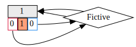

# CACH-FRIENDLY LIST
This is basicly a 'list' with ability of optimizing it-self (O(n)) for a nice work with cach and even O(1) indexing when being optimized! Use it if you want to reach far maximum of lists speed.

Bonus: pretty graphviz dumer :3
